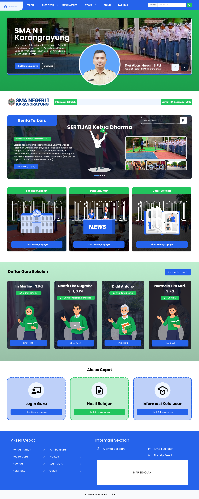
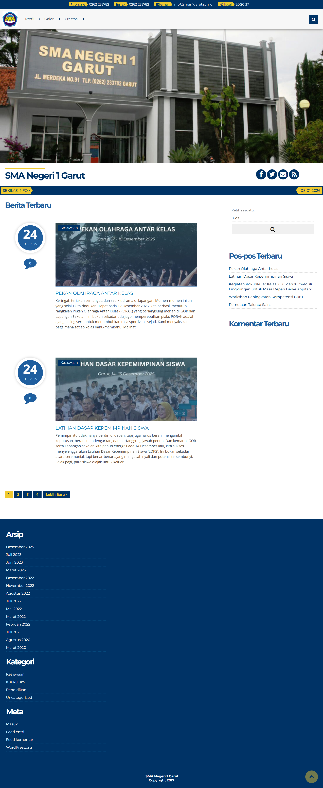

# Webpage Design Portfolio

Kumpulan desain website berbasis Figma.

## Projects

### 🏫 Basic School Website – UI Design
Desain website company profile untuk sekolah.

[👉 Lihat detail project](./Basic-School-webDesign-1)

<table>
  <tr>
    <td width="50%" align="center">
      <h2>Before</h2>
      

        
      

    </td>
    <td width="50%" align="center">
      <h2>After</h2>
      

        
      

    </td>
  </tr>
</table>

### 🏫 Basic School Website 2 – UI Design
Desain website company profile untuk sekolah.

[👉 Lihat detail project](./Basic-School-webDesign-2)

<table>
  <tr>
    <td width="50%" align="center">
      <h2>Before</h2>
      

        
      

    </td>
    <td width="50%" align="center">
      <h2>After</h2>
      

        
      

    </td>
  </tr>
</table>
